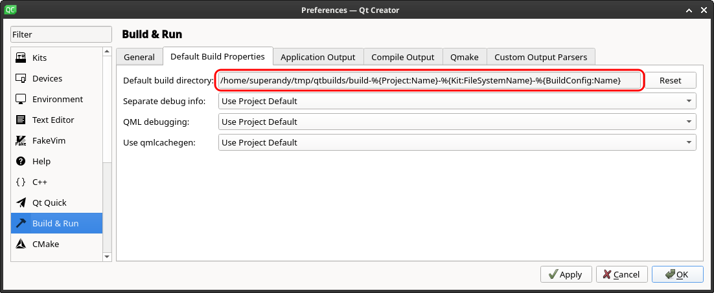
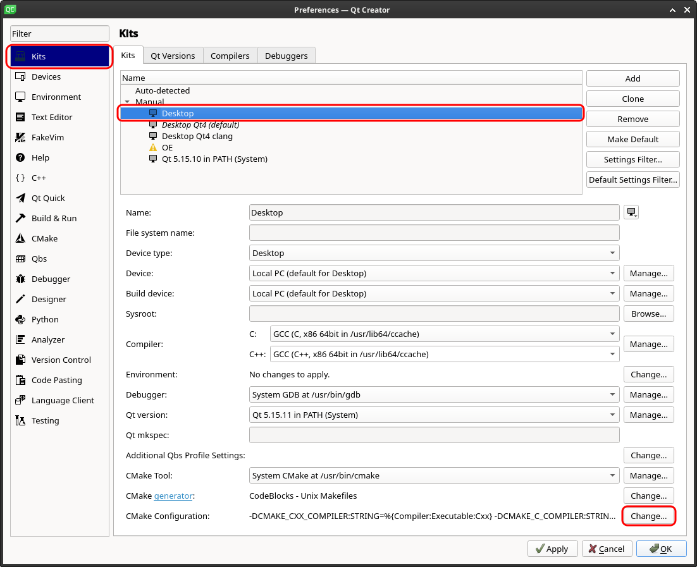
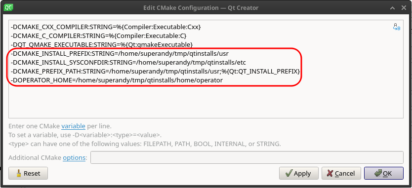

# zera-metaproject

Superbuild project for close to all zera repos.

For simple and reproducible setup of Fedora XFCE spin check [Fedora setup](https://github.com/schnitzeltony/fedora-setup)

## clone Project
```
git clone --recurse-submodules git@github.com:ZeraGmbH/zera-metaproject.git
```

to update
```
git pull
git submodule update --init --recursive
```

## Qt-Creator initial setup
* Open Edit / Preferences
* Select default build directory as:
  
  Example:
  ```
  /home/superandy/data/tmp/qtbuilds/build-%{Project:Name}-%{Kit:FileSystemName}-%{BuildConfig:Name}
  ```
  Intention: Keep all build files in one directory -> build from scratch can be performed by deleting path
* Select Kits / Desktop / CMake Configuration as:
  
* Add / modify CMake variables as:
  
  The following variables are used by projects in zera-metaproject:
  * **CMAKE_INSTALL_PREFIX**: Prefix path, files are installed to - same as first part of **CMAKE_PREFIX_PATH**
  * **CMAKE_INSTALL_SYSCONFDIR**: Path where configuration files are installed to
  * **CMAKE_PREFIX_PATH**: ';' - separated CMake search prefix path. The directory set in **CMAKE_INSTALL_PREFIX** should be first entry
  * **OPERATOR_HOME**: Path where the license-files should be installed to and where user data is stored

  Example CMake variables:
  ```
  -DCMAKE_PREFIX_PATH:PATH=/home/superandy/data/tmp/qtinstalls/usr;%{Qt:QT_INSTALL_PREFIX}
  -DCMAKE_INSTALL_PREFIX:PATH=/home/superandy/data/tmp/qtinstalls/usr
  -DCMAKE_INSTALL_SYSCONFDIR:PATHUNINITIALIZED=/home/superandy/data/tmp/qtinstalls/etc
  -DOPERATOR_HOME:PATH=/home/superandy/data/tmp/operator
  ```
* Make applications log appear in Qt-Creator by adding
QT_ASSUME_STDERR_HAS_CONSOLE=1 to Kit's Environment

## Add Subproject to SuperBuild

### Add to git 
To add a subproject first add it in git with following command:

```
git submodule add -b <branch> git@github.com:ZeraGmbH/<project> <path>/<project>
```

for example:
```
git submodule add -b master git@github.com:ZeraGmbH/vf-declarative-gui.git guis/vf-declarative-gui
```

check if the submodule appears in .gitmodules.

### Add to CMake
To add the project to cmake open CMakeLists.txt and add following lines:

```
set(name <project>)
set(path <path>)
set(deps <dep1> <dep2> <dep3>)
add_sub_project_deps(${name} ${path} "deps")
```

Please note that the project order is important. The project must be added after all projects it depends on. 
The dependencies will determine the build order during make. 

## Issues
* If one of these steps is executed wrong it might happen that the build will not work. 
In this case delete the build folder. In case you are using qt creator remove CMakeLists.tyt.user and import the project again. 
Then repeat the setup steps.
